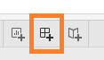

```{r setup, include=FALSE}
knitr::opts_chunk$set(
  fig.retina=3,
  echo = FALSE,
  eval = TRUE,
  warning = FALSE,
  message = FALSE
  )
```


```{r loading-packages}
packages = c('tidyverse', 'knitr', 'rmarkdown', 'kableExtra')

for(p in packages){library
  if(!require(p, character.only = T)){
    install.packages(p)
  }
  library(p, character.only = T)
}
```

# 1.0	The original visualization

The original visualization is created with data sourced from Ministry of Manpower, Singapore website [(MOM)](https://stats.mom.gov.sg/Pages/LabourForceTimeSeries.aspx). Data used for this is labelled under "Resident Labour Force Participation Rate by age and sex".


# 2.	Critiques on Clarity and Aesthetics

From the original graphic, these are some of the issues in terms of clarity and aesthetics identified. The critiques and suggestions are listed below:

In terms of **clarity**:

```{r}
Critique = c("**Chart title**: The chart title 'Labour force participation rate' is brief and does not give much information regarding what the chart is trying to convey.",
             "**Addreviated Y  Axis label**: Use of abbreviated Y axis labels 'LFPR' leaves the reader to interpret what is Y axis is referring to.",
             "**Missing units in Y axis label**: In addition to abbreviated label units of the data is not shown leaving readers to guess the units and what the numbers signify.",
             "**Inconsistent arragment of age-group**: The visualisation presents the age group according to the their Y values resulting in a inconsistent arrangements of the age groups. The 15 to 19 age group is slotted among the 70 and older age groups. It may be confusing to the reader and readers attention are drawn to the raising pattern.",
             "**Overlapping Age groups presented**: In the visualisation 3 'over 70s' age groups are presented. '70 to 74', '75 and over' and '70 and over'. Resulting in an overlap of presented data between the 70 to 74, 75 and over with the 70 and over age-groups.",
             "**Compressed X-Axis for year**: Not immediately visible from the visualisation, the curves of each age group are derived from yearly labour front participation rate values in each age group for a period of 2010 to 2021.")

Suggestion = c(" More insights could be indicated as part of the chart title from findings of the visualisation. For example 'Labour Force participation rates sees increase for most age groups from 2010 to 2021'",
               "It could be stated in full and be more specific such as 'Age Group Labour participation rate'.",
               "% could be indicated, allowing readers to know that it is in percentage of age-group.",
               "Instead the natural order of the age group with youngest on the left and oldest on the right should be used. Allowing readers to better orientate to the data on the visualisation.",
               "The '70 to 74' and '75 and over' age groups could be remove only showing data from the 70 and over age-groups to remove the overlapping data. ",
               " Compressing the view in such a manner may confuse the reader and some data reduction or summary could be used such that the full year range is indicated instead. Alternatively the year range could be stated in the title and the use of dot points on a line chart to represent the years will be explored.")

clarity <- data.frame(Item = c(1,2,3,4,5,6), 
                        Critique,
                        Suggestion)

kable(clarity,align = "cll") %>%
kable_styling(full_width = F) %>%
column_spec(1, bold = T) %>%
column_spec(2, width = "30em") %>% 
column_spec(3, width = "30em")  

```
In terms of **aesthetics**:

```{r}

Critique <-  c("**Unnecessary use of color**: The use of separate colors for each of the age groups may not be necessary given that they are separated by individual column labels. Using of separate colors require the reader to keep track of numerous colors with respect to the age groups.",
               "**Obstructed Column Labels**: Certain age group labels such as age groups '70 & over' are hidden due to size of column. While column size should be consistent, the labels should also be readiable.",
             "**Use of shaded area plot**: The use of a shaded area plot results in large unused space under groups that have higher larbour participation rate compare to other age groups.",
             "**Non-Intuitive age-group arrangement**: Result of arranging the age groups by y-axis values results in age groups mostly arrange from older on the left to younger on the right. Instead it should follow the natural order of age groups going from young to old.")

Suggestion = c("Instead if a column label is used then a single colour could be used unless there is a difference then a different color for those specific points could be used to highlight those data points.",
               "Depending on final graphic, age-groups should be labelled such that the groups are clearly readable.",
               "While it does the highlight the difference in participation rate between age groups the unused space could be used for annotations to highlight specific insights in the visualization.",
               "Arrange the age groups by natural order, such that readers could orientate the different data points better.")

aesthetics <- data.frame(Item = c(1,2,3,4),
                         Critique,
                         Suggestion
                         )

kable(aesthetics,align = "cll") %>%
kable_styling(full_width = F) %>%
column_spec(1, bold = T) %>%
column_spec(2, width = "30em") %>% 
column_spec(3, width = "30em")  


```

# 3.	Proposed Design

## 3.1 Considersations

Based on exploration of the data it is assumed that the density chart is derived from yearly participation rate of each age group. The purpose of the chart is to compare the labour participation rate for each of the age groups as well as show their trends over the years. 

The high number of different groups makes the use of a stack bar chart difficult without grouping of the age groups and it would not be ideal for comparison between the groups.

Using a overlay of lines charts with each line chart representing a age group could be used, however the overlap in labour participation rates for certain age groups especially between ages 25-50 would result in a cluttered portion of the chart that would be difficult to read.

For better comparison ideally the graphics for each age group should be placed side by side.

## 3.2 Proposed Sektch

In keeping with the original visualization without significant changes a line graph with dots is use instead of a shaded area chart to show the year to year changes of participation rate for each age group. From the original visualization it seem there is an overall increasing trend in labour force participation rate for all age-groups. Thus showing the difference between the two years at either end of the data points should summarize the trend of the original. To accompany the line graph a bar chart is generated to show the absolute difference in labour participation rate for each of the age groups and summarize the overall trend of the graphic.


## 3.2	Advantage of proposed design

The advantages of proposed design:

In terms of **clarity**

- Use of title and caption spaces of each chart to show insights from the visualisation will give readers a more complete picture of what the graphic is about and trying to convey.
- Instead of using a full x-axis with years for each of the age-groups dots are used to show the year to year percentage values without need for axis labels, such that obscured labels would not be shown with the chart and readers are able to interpret the individual years and participation rate from the dots on the chart. The year range will also be indicated in the title such that it is clear to the reader.
- Positioning the line graphs side by side would allow readers to compare difference in participation rate between each of the age-groups.
- Full axis labels with units such that readers are not left to interpret what the axis are about.
- Age groups are arranged in natural order so that readers could easily orientate the data and make their own comparison.
- Overlapping data is also removed to reduce confusion with the presented information.

In terms of **aesthetics**

- The used of line graph instead of shaded area graph will reduce non-data ink on chart, using the space to highlight insights from the chart.
- For age-groups are presented as a single colour to reduce data ink, and color is only used to highlight trends on the charts.

# 4.	Data Visualization Process (line graph)

## 4.1 Data Preparation 

The data set is stored in a wide format instead and as a excel file. The following steps were taken to wrangle the data data into tidy format with excel. The original file stores the data as two separate spreadsheets "mrsd_Res_LFPR_1" and "mrsd_Res_LFPR_2". For this visualization data from from "mrsd_Res_LFPR_2" will be used.


To prepare the data for visualisation the following steps were performed.

```{r}

Steps <-  c("Using excel, delete comments and unused rows in the data set. In this case rows 1, 2, 10, 11, 18, 19, 26 to 32.",
               "Based on data notes 2007a refers to data of the year 2007 after adjustment. Column data for year 2007 is deleted and column 2007a is renamed as 2007.",
             "A column is added between the 'Age_Group/Sex' and '1991' column and labelled as 'Genders'. 'Both', 'Males' or 'Females' are keyed into this column according their data label as stated in rows 2, 17 and 32 as highlighted by the red rectangles. 'Boths' for 'Total', 'Males' for 'Males' and 'Females' for 'Females'. This wil be used to separate data values later in Tableau. In the same step Age-Group/Sex column is renamed as Age-Group. At this stage the data is save as an excel file.",
             "Data from the previous step is opened in tableau using tableau's connect to a file option. Since the file is in excel, 'Microsoft Excel' is selected and the excel file is opened in Tableau.",
            "The required sheet drag over into the data flow pane, in this case the sheet named 'mrsd_Res_LFPR_2'.",
            "The 'Field Names are in first row' option is check to convert first row values to row names.",
            "Next the table is pivoted by to convert the data into long format. This is done by holding down the shift key and while clicking and dragging across all the individual year labelled columns to select them. Then right clicking the selection and click pivot.",
            "Respectively generated column names 'pivot field Names' was rename to 'Year' and 'Pivot Field Values' to 'Labour Force Participation Rate'.",
            "Lastly due to N.A. values present in some years, the 'Labour Force Participation Rate' data type needs to be change from default character data type to decimal by clicking the # icon in the column and selecting number(Decimal)."
            )

Images = c("",
               " ",
               ".",
               "",
           "",
           "",
           "",
           "",
           ""
           
           )

aesthetics <- data.frame(Item = c(1,2,3,4,5,6,7,8,9),
                         Steps,
                         Images
                         )

kable(aesthetics,align = "clc") %>%
kable_styling(full_width = F) %>%
column_spec(1, bold = T) %>%
column_spec(2, width = "20em") %>% 
column_spec(3, width = "40em")  


```


## 4.2 Connected line graph visualization 

The following steps were used to create the line graph visualization:

```{r}

Steps <-  c("Using the data from the previous step, variables 'Age-Group' follow by 'Year' is drag over to the columns shelf. 'Then Labour Force Participation' is dragged over the the rows shelf.",
               "Labour Force participation rate is converted to a measure by right clicking the pill on in rows shelf. Selecting sum under the measures menu.",
             "Years pill is then dragged and dropped into the filters tab. A filter menu will pop up and as only data from years 2010 to 2021 will the used, the other years are unchecked. Then click apply and OK.",
             "Age group pill is then dragged and dropped into the filters tab. Uncheck options '70 to 74', '75 & over', 'Females', 'Males' and 'Totals' to filter out overlapping data created from earlier step.",
            "Genders is then dragged and dropped into the filters table. Check the option 'both' to remove values from 'Males' and 'Females'.",
            "The chart is changed from a bar graph to a line chart by selecting 'line' from the Marks drop down menu.",
            "Dots were added to the line chart by clicking 'Color' in the Marks tab and selecting all to show the points as highlighted in the orange box.",
            "Y axis labels were changed by right clicking the current axis labels and selecting axis. Axis title is changed to 'Labour Force Participation Rate (%)'.",
            "The Chart title was change to 'Singapore Labour Force Participation Rate (2010 to 2021)'. Font was  converted to bold and color was changed by right clicking the title area and selecting 'Edit Title'. A subtitle was also added in this step in font 11, black text, 'Singapore's workforce sees increase in labour participation rate from 2010 to 2021 for most age-groups. Only 20-24 age group observed drop in participation rate. '" ,
            "Annotations were added to highlight certain trends. To do this right click the area under the 20 to 24 age group trend line, and under the annotate menu select area. A textbox would show up and appropiate insight is added.",
            "To format the annotation box, right click the box and select format. Border was change to grey color with solid line and rounded corners as highlighted in orange rectangle.",
            "Similar annotation was added for the seniors population by right clicking the area under 55 to 59 population and repeating steps 10 and 11 to format the shape and color of the annotation box.",
            "Similar annotation was added for age-group 30-55 by right clicking the area under 30 to 55 age-groups and repeating steps 10 and 11 to format the shape and color of the annotation box.",
            "To highlight the decreasing trend in age-group 20 to 24, a set is first created by right clicking Age-Group dimension and selecting set under the create menu. Followed by checking the 20 to 24 group in the pop up menu and clicking okay.",
            "Drag and drop the 'Age-Group' set to color option as indicated by the orange arrows. Next click on color then 'edit colors'. Select red for 'in' group and blue for 'out'.",
            "With color used to highlight the downward trend a legend is not require. The automatically generated legend is hidden by clicking the tab in the top right corner of the legend and selecting 'hide card'.",
            "Lastly the worksheet is renamed as 'Trend' by right clicking the sheet tab at the bottom and renaming it to 'Trend'."
            )

Images = c("",
               " ",
               ".",
               "",
           "",
           "",
           "",
           "",
           "",
           "",
           "",
           "",
           "",
           "",
           "",
           "",
           ""
           )

aesthetics <- data.frame(Item = c(1,2,3,4,5,6,7,8,9,10,11,12,13,14,15,16,17),
                         Steps,
                         Images
                         )

kable(aesthetics,align = "clc") %>%
kable_styling(full_width = F) %>%
column_spec(1, bold = T) %>%
column_spec(2, width = "20em") %>% 
column_spec(3, width = "40em")  


```


# 5.	Data Visualization Process (Difference Graph)

## 5.1 Data Preparation 

The following steps were used to prepare the data for a graph to indicate difference in labour force participation rate between 2010 and 2021. The same data would be used without pivoting the data in Tableau, the tidied data worksheet from above steps was renamed as "msrd_res_Data_Double" and the excel file was save as a separate file with a different name.

```{r}

Steps <-  c("Copy of data is added into tableau as another data source by clicking the data source icon at the top of the pane and select the 'new data source' option.",
            "To avoid confusion, the previously added data is renamed as 'Chart 1 Data', copy of data to be loaded renamed as 'Chart2 Data' by click the data source name and keying the desired name for the data source.",
             "Required spreadsheet 'msrd_res_Data_Double' is dragged and dropped to the main pane and used as is after loading."
            )

Images = c("",
               "",
               ""
           )

aesthetics <- data.frame(Item = c(1,2,3),
                         Steps,
                         Images
                         )

kable(aesthetics,align = "clc") %>%
kable_styling(full_width = F) %>%
column_spec(1, bold = T) %>%
column_spec(2, width = "20em") %>% 
column_spec(3, width = "40em")  


```


## 5.2 Difference Visualization

The following steps were used to create the bar graph to show difference of labour participation rate between the years 2010 and 2021.

```{r}

Steps <-  c("Start with adding a new worksheet, by clicking the new sheet icon.",
            "A new Calculated field is created to determine the difference in labour particpation rate between years 2010 and 2021. This was done by right clicking an empty space in the tables space, and selecting 'Create Calculated Field'. Then adding the formula [2021] - [2010]. ",
             "The Age-Groups pill is placed in columns and the calculated field 'Difference' is placed in the rows pane.",
            "Gender is dragged and dropped to the filter pane, 'males' and 'females' are left unchecked only checking 'Both' to keep the totals data.",
            "Age-Group is dragged and dropped to filters pane, options '70 to 74', '75 & over' and 'Total' are unchecked to remove overlapping data.",
            "The age groups are then sorted from youngest to oldest age group by right-Clicking age-group and select sort. In the follow on popup menu select sort the rows in descending order.",
            "Drag and drop a 'Difference' calculated field to colors. To add colors to the plot to highlight positive and negative values.",
            "Right click the SUM(Difference) color legend to format the colors. Check the stepped color option and key 2 into number of steps. Next change the colors for negative values by clicking the square represeting negative value colors and selecting light red in the follow on pop up menu. Do the same for positive color square to light blue",
            "Drag and drop the calculated field 'Difference' over to Label in the 'Marks' tab to indicate calculated difference values.",
            "Add appropriate title by right clicking the title of the chart. In this case 'Difference in Labour Participation rate (2021 vs 2010)'. A subtitle is also added 'Biggest increase in seen in 65 to 69 age group as older workers remain in work force, while drop in 20 to 24 group as younger workers join workforce later.'",
            "Add Y-Axis Labels 'Percentage Point Difference' by right clicking the y-axis labels and editing the Title field.",
            "Rename the worksheet to 'Difference' by right clicking the bottom worksheet tab and selecting rename."
            )

Images = c("",
               "",
               "",
               "",
           "",
           "",
           "",
           "",
           "",
           "",
           "",
           ""
           )

aesthetics <- data.frame(Item = c(1,2,3,4,5,6,7,8,9,10,11,12),
                         Steps,
                         Images
                         )

kable(aesthetics,align = "clc") %>%
kable_styling(full_width = F) %>%
column_spec(1, bold = T) %>%
column_spec(2, width = "20em") %>% 
column_spec(3, width = "40em")  


```

## 6.0 Dashboard both graphics

In the following steps both graphics are assembled together with the use of a dashboard.

```{r}

Steps <-  c("Start a new dashboard by clicking add dashboard icon at the bottom of window highlighted in orange.",
            "Drag and drop the 'Trend' worksheet over to the main pane first, followed by dragging and dropping the 'Difference' worksheet below it.",
            "Check the 'Dashboard' title option to show a dashboard title. ",
            "Format title to have a dark grey background by right clicking the title and selecting the format title option. Under shading change the color to grey to highlight the title. ",
            "Right click the dashboard title and edit the title to be with bold font size 16 white text and add 'Singapore sees increase in labour force participation rate in 2021 from 2006'",
            "Right click within the bottom sheet without any feature highlight to bring up the features menu. Check 'caption' to add a caption at the bottom of lower worksheet. Weblink to the data source is added to the caption as a reference.",
            "Finally hide both 'Trend' and 'Difference' worksheets before publishing the workbook by right clicking the respective worksheet names and clicking hide."
            )

Images = c("",
           "",
           "",
           "",
           "",
           "",
           ""
           
           )

aesthetics <- data.frame(Item = c(1,2,3,4,5,6,7),
                         Steps,
                         Images
                         )

kable(aesthetics,align = "clc") %>%
kable_styling(full_width = F) %>%
column_spec(1, bold = T) %>%
column_spec(2, width = "20em") %>% 
column_spec(3, width = "40em")  


```
# 6. Final Visualization

A screenshot of the final visualization is shown below:


Full visualization could be found on tableau public [here](https://public.tableau.com/app/profile/caine.ng/viz/DatavizMakeover1-LFPR/Dashboard1)

# 7.	Main Observations

Listed below are some of the observations drawn from the made over graphic:

```{r}
aesthetics <- data.frame(Item = c(1,2,3,4),
                         Obervation = c("Overall Increase in participation rate.",
                                      "Biggest increase seen in Age-Groups 65 to 69.",
                                      "Drop in workforce participation in age-group 20 to 24.",
                                      "Sharp drop in labour participation rate for youths 15 to 24 in 2020."),
                         Takeaway = c("Comparing the labour participation rate between 2010 to 2021 majority of the age groups show an increase in particition rate over the years. Indicating that more individuals remain work even to later years, which could possibly be attributed to raising cost of living or changes in family roles to support both elders and childern. The working adult age groups of between ages 25 to 54 has increased by 4.4percent to 9.4percent.",
                                         "The biggest increase in labour force participation rate is seen in 65-69 age group by a difference of 20 percentage points between 2021 and 2010. This is likely driven by changes in employment policy over the years to allow for senior workers to remain in the work force. Increase in recent years could also be related to increase in demand for workers in roles such as security and pandamic related services leading to seniors returning to the work force.",
                                         "From 2010 to 2021, the only age group to see a drop in labour participation rate is the 20 to 24 group. Indicated by a drop of -3.4 percentage points. This is likely driven by changes in education demands and more youths seeking degrees before starting their first job.",
                                      "Both age-groups (15 to 19, 20 to 24) saw a drop in labour participation rate in 2020. This drop was more severe for the 20-24 age group from 61% to 56%. This is likely driven by Covid-19 pandemic restrictions on F&B service which are typically staffed by young part-time workers. It could also be driven by difficult of fresh graduates seeking employement during this period, as companies are cutting cost. However the overall participation rate increase up in 2021 as youths finding alternate employment opportunities."))
library(knitr)
kable(aesthetics,align = "cll")%>%
kable_styling(full_width = F) %>%
column_spec(1, bold = T) %>%
column_spec(2, width = "20em") %>% 
column_spec(3, width = "40em") 

```