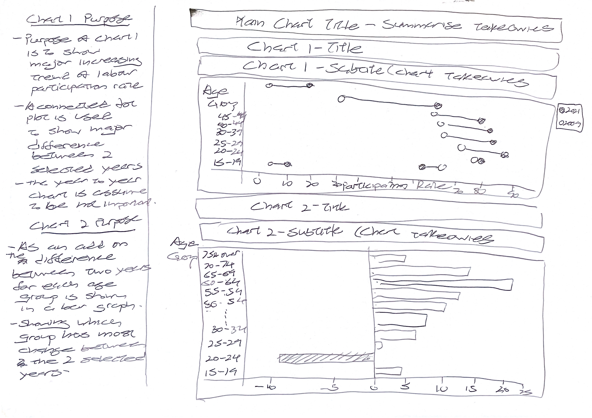

```{r setup, include=FALSE}
knitr::opts_chunk$set(
  fig.retina=3,
  echo = FALSE,
  eval = TRUE,
  warning = FALSE,
  message = FALSE
  )
```

# 1.0	The original visualization

The original visualization is created with data sourced from Ministry of Manpower, Singapore website [(MOM)](https://stats.mom.gov.sg/Pages/LabourForceTimeSeries.aspx). This task is to critique and provide some suggestions this visualization based on clarity and aesthetic framework and to produce an alternative visualization based on suggestions.


# 2.	Critiques on Clarity and Aesthetics

From the original graphic, these are some of the issues in terms of clarity and aesthetics identified. The critiques and suggestions are listed as below:

For the **clarity**:

```{r}
critiques <- data.frame(Item = c(1,2,3,4,5,6), 
                        Critique = c("Brief Chart title - Chart title could be made more informative explaining what the chart is about.",
                                     "Addreviated Y  Axis label - The label 'Lfpr' may not be clear to every reader what it refers to.",
                                     "Missing units – Units for the y axis is not indicated, leaving readers to guess what the numbers signigy.",
                                     "Non-intutive arragment of age-group: Arranging the Age-groups in reverse, requires reader addition effort to interpret the infromation.",
                                     "Inconsistent ordering of age groups: The order is arranged by the participation rate instead of natural order of age-group, presents an trend that do not exist.",
                                     "Use of shaded density-Chart: The use a line graph may mislead readers to a trend that does not exist."),
                        Suggestion = c("Title should be informative. It could state “Singapore Age labour force participation rate for 2015.",
                                       "The Y axis labels could be state in full such as 'Percentage Participation Rate' or shorten to percentage with units since it could be explain as part of title or caption.",
                                       "% units should be listed.",
                                       "Age groups have a natural order and should be displayed in normal ascending order.",
                                       "Inline with point 4, age-groups should follow natural order instead of participation rate. ",
                                       "Depending on the intended message the visualization is trying to impart a different design might be used. If intending to show absolute percentage of participation rate then a bar graph could be used or if intending to show summary of changes in each age group then a summary figure should be use to group the age groups.")
                        )
library(knitr)
kable(critiques,align = "cll")
```
For the **aesthetics**:

```{r}
aesthetics <- data.frame(Item = c(1,2,3,4),
                         Critique = c("Unnecessary use of color - With the age groups indicated by a second X axis the label of colors would is not necessary and requires interpretation.",
                                      "Compressed bottom x-axis - In order to show the full chart, x axis is compressed to single year value obscuring the other years.",
                                      "Obstructed Column Labels - For certain age group labels are hidden due to size of column. While column size should be consistent, the labels should be clearly display as well.",
                                      "No annotation to indicate findings from the chart, leaves readers to interpret trends for themselves."),
                         Suggestion = c("With age groups indicated by separate column labels a single color would be used unless to highlight important groups.",
                                        "Due to numerous years in the dataset, age-groups could be reduced to demographic groups to reduce the number of levels. After reducing the levels, data could be present as summary general summary statistic of the whole instead of details of every group. The major trend could be shown in another graph as difference between two time periods.",
                                        "Depending on final graphic, age-groups should be labelled such that the groups are clearly readable.",
                                        "An caption or annnotation to indicate findings for the chart."))
library(knitr)
kable(aesthetics,align = "cll")

```

# 3.	Proposed Design

## 3.1 Considersations

Based on exploration of the data it is assumed that the density chart is derived from yearly participation rate of each age group with the intention of conveying changes in participation rate of each age group. However, the effect of compressing the x-axis to show the entire chart results in only showing the year as 2015.  Due to large number of groups and years in the chart prohibits the use of a trend line or bar graph to indicate the participation rate for all the years.  Major trends would need to be summarized or level of variables need to be reduced by grouping..

## 3.2 Proposed Sektch

From original visualization it seem there is an overall increasing trend in labour force participation rate for all age-groups. Thus showing the difference between two years at either end of the data points should summarize the trend of the original. To revise the visualization to show the major trends a connected dot plot is used to indicate the most recent year and a earlier year's difference in labour participation rate. Accompanying the dot plot is a bar graph show the actual percentage value change between both years for easier reading.



## 3.2	Advantage of proposed design

The advantages of the new design are as follows:

- Major trends in over the years still visible and reader is able to see the difference between two selected years.
- Due to large number of groups preferred not to present all data in a line/density plot, instead summarizing the overall trend with a connected dot plot presents major trends with overloading reader with colors and lines.
- Reduced number of colors on the plot for readers to interpret.
- The age groups in proposed sketch are arrange by natural order for readers to quickly find data.
- With age groups presented in the Y-Axis, the labels should not be obscured.
- Appropriate titles, captions and axis labels allow easier interpretation and show major findings of the chart.

# 4.	Data Visualization Process (Dot graph)

## 4.1 Data Preparation 

The difficulty in data preparation comes from data source being store in a wide format instead of tidy format for visualization. The original data is saved in excel format and initial tidying of data was done in excel. The original file stores the data as two separate spreadsheets "mrsd_Res_LFPR_1" and "mrsd_Res_LFPR_2". For this visualization data from from "mrsd_Res_LFPR_2" will be used and tidied. As there is missing data in years 1995, 2000 and 2005, the data taken will be from 2006, onwards.


1. Using excel, delete comments and unused rows in the data set. 


2.	Based on data notes 2007a refers to data of the year after adjustment. Column data for 2007 is delete and column 2007a is renamed as 2007.
 

3.	A column is between the age-group column and data sorted in years.
In this new column input whether is data is for "Both" genders, "Males", or "Females" as shown in the orange highlighted box, according to major labels highlight in red. This new colmun is labelled as "Gender"
This is used to separate data values later in Tableau.
In the same step Age-Group/Sex column is renamed as Age-Group. At this stage the data is save as an excel file.


4.	Data from the previous set is opened in tableau using tableaus open add option. 


Required sheet drag over into the data flow pane.


5.	The "Field Names are in first row" option is check to convert first row values to row names.


6.	Next the table is pivoted to convert the data into long format.


7.	Respective fields were then rename to indicate their values. Pivot Field Names to "Year", and Pivot Field Values to "Labour Force Participation Rate".


8.	Lastly due to N.A. values present in some years, the "Labour Force Participation Rate" data type needs to be change from default character data type to decimal.


## 4.2 Connected dot plot visualization 

The following steps were used to create the connect dot visualization.

1. Using the data from the previous step, a new calculated field is created to filter out participation rate in 1991 and 2021.


2.	Age-Group is placed in columns and Labour Force Participation rate is placed in Rows, it is also converted to a sum dimension to show the actual values.


3.	Year is added to filter to filter out years that are not shown in the view. Likewise for gender to show only the data from total instead of separate male and female data.


4.	The default marks is changed from automatic to circle and years added to color to differentiate the years.


5.	Axis is flipped to show percentage length wise.


6.	For second "Labour Participation rate is dual axis option is check to collapse both charts together.


7.	Overlapping data points 70 & over and hidden by right clicking the data point and selecting "hide".


8.	Lastly appropriate title, summary caption and axis labels are added by right clicking the respective fields, and selecting "edit"

For the title the chart is changed to "Singapore Labour Participation Rate (2021 vs 2009)", font size 15, in bold and using light blue font color.
A subtext "Overall increase in labour participation rate observed. More workers remain working at older age. Younger workers starting work later."

For X-axis label is changed to "Age-Group Participation Rate(%)"
A subtext "Overall increase in labour participation rate observed. More workers remain working at older age. Younger workers starting work later."

9. Results shown below.

10. Rename the sheet as "SummaryRate" by right clicking the sheet tab at the bottom of the window.


# 5.	Data Visualization Process (Difference Graph)

## 5.1 Data Preparation 

The following steps were used to prepare data for a graph to indicate difference between both years.

1. Tided data from above steps was save as a different name with excel.
2. Copy of data is added into tableau as another data source, using new data source option.


3. To avoid confusing previous data is renamed as "Chart 1 Data", copy of data to be loaded renamed as "Chart2 Data" by click the data source name and keying the desired name for the data source..


3.	Required spreadsheet is moved to the main pane and used as is after loading.


## 5.2 Difference Visualization

The following steps were used to create the bar graph to show difference of labour participation rate between the two years.

1. Start by adding a new sheet, by clicking the new sheet icon.


2. A new Calculated field is created to determine the difference in labour particpation rate between years 2009 and 2021


3.	Age-Group is placed in rows and the calculated field "Difference" is placed in the main pane.


3.	gender is added to the filter pane filter out "males" and "females" data keeping only total "Both"


4.	Age-Group is added to filters pane to filter out overlap data points "70 & Over" and "Total"


4.	The "Difference calculated field is moved to the Columns shelf.


5.	Right-Click age-group and select sort to sort the rows in descending order.


6.	Move the a "Difference" calculated field to colors.


7.	Right click the SUM(Difference) color legend to format the colors as two stepped color with center at 0. Change the colors to show red for negative values and blue for positive.


8.  Move calculated field "Difference" to Label to indicate calculated difference values.

9.  Add appropriate title as show in previous section. In this case "Difference in Labour Participation rate (2021 vs 2006)". Similarly a sum title is added "Biggest increase in seen in 65 to 69 age group as older workers remain in work force, while drop in 20 to 24 group as younger workers join workforce later.."

9.  Add X-Axis Labels "Difference in percentage point".

10. Make adjustments to show all labels.


11. Rename the sheet as difference.

# 5.	Data Visualization Process (Difference Graph)

## 5.1 Data Preparation 

The following steps were used to prepare data for a graph to indicate difference between both years.

1. Tided data from above steps was save as a different name with excel.
2. Copy of data is added into tableau as another data source, using new data source option.


3. To avoid confusing previous data is renamed as "Chart 1 Data", copy of data to be loaded renamed as "Chart2 Data" by click the data source name and keying the desired name for the data source..


3.	Required spreadsheet is moved to the main pane and used as is after loading.


## 6.0 Dashboard both graphics

To put both graphics together a dashboard is used.

1. Start a new dashboard by clicking add dashboard icon.


2. Drag and drop the summaryRate worksheet first, followed by dragging and dropping the Difference worksheet below it.


3.	Drag a "Blank" element to the right of "Difference" worksheet and adjust the size of such at it is aligned with SummaryRate worksheet.


3.	Check the "Dashboard" title option to show a dashboard title. 


4. Format title to have a dark grey background, with bold font size 16 white text and add "Singapore sees increase in labour force participation rate in 2021 compared to 2006"


5.	Right click within the bottom sheet without any feature highlight to bring up the features menu. Check "caption" to add a caption at the bottom of lower worksheet indicating source of data. 


5.	Finally hide both "summaryRate" and "Difference" worksheets before publishing the workbook.

# 6.	Main Observations


```{r}
aesthetics <- data.frame(Item = c(1,2,3),
                         Obervation = c("Overall Increase in participation rate.",
                                      "Biggest increase seen in Age-Groups 65 to 69.",
                                      "Drop in workforce participation in age-group 20 to 24."),
                         Takeaway = c("Comparing the labour participation rate between 2021 and 2006 and overall increase in most age-groups can be seen. Indicating that more are remaining in the workforce as years progresses.",
                                        "The biggest increase in labour force participation rate is seen in 65-69 age group by a difference of 25.6 percentage points. Indicating that more are choosing to retire later compared to workers in 2006.",
                                        "The only group to see a drop in labour force participation is the 20 to 24 age group. It could signify a choice to more youths starting work later due to process of optaining higher education."))
library(knitr)
kable(aesthetics,align = "cll")

```