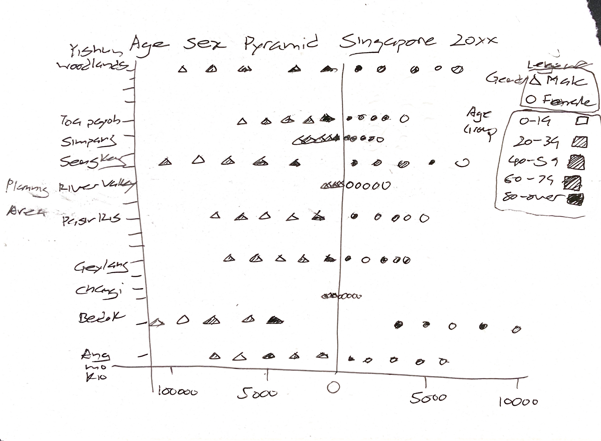

```{r setup, include=FALSE}
knitr::opts_chunk$set(
  fig.retina=3,
  echo = TRUE,
  eval = TRUE,
  warning = FALSE,
  message = FALSE
  )
```

# 1.0 Introduction

In this take home exercise the task will be to design a age-sex pyramid based visualization that shows the change of demographic structure of Singapore by age cohort and gender between 2000 to 2020 at the planning area level. 

# 2.0 Challenges and considerations

The challenges of this exercise is to show the additional variables in a clear way. Typically a age-sex pyramid would allow the reader to see the distribution of the population by age-group and sex. Animation could be added to show the changes in each group over the years, however the addition of presenting data at the planning area level presents difficulty due to numerous levels in the planning area variable.

* Ideally to present change an animation or transition could be used such that the viewer would be able to see changes in the data visually rather than compare visually using static filtering methods. 
* The numerous Age groups and planning area if presented individually as is creates a lot of data points in the visualization which would require additional mental load from the viewer to keep track of the information.
* The large number of planning areas also prohibits, using a facet approach.
  + Thus some grouping of the data points would be required. 
  + Assuming that comparing the planning areas is crucial to the visualization, group the age groups to 10 year increments instead of 5 to reduce the data levels without significant lost in information.
  + If required the age groups could be further grouped wider bands such as 'youth', 'adults' and 'seniors'
  + Alternatively individual plots of each planning area could be presented side by side in a facet approach.
* Typical a bar chart is used in a Age-Sex pyramid, the numerous categories of data make using a stacked bar graph difficult to read. Instead used of dots will be explored to display the numbers of each age group along the x-axis. 
* Typical the genders are represented by colors with only two levels, shapes could be used instead.

# 3.0 Proposed solution and Sketch

The propose solution would be a modified Age-Sex pyramid, with the planning areas in the Y-axis instead of age group. Numbers in each age group are represented by points in the chart with shapes to differentiate between gender and colors to indicate the age-group. Animation will be used to show changes in the various demographics over the years. A sequential color scheme could be used for the age-groups. Using sequential colors make reading of the chart intuitive and require less mental load to keep track of the legend.

## Proposed Sketech.



# 4.0 Loading Required packages

For this task following r packages are loaded:
   1. **tidyverse**: For loading and wrangling of data.
   2. **gganimate**: Use for animating the static plot.
   3. **plotly**: Alternative animation package. Loading for exploration purpose. Plotly allows combination of using interactive tooltips and animation.
   4. **RColorBrewer**: Is loaded to have additional color pallette available.
   5. **rmarkdown** will be used to visualize the table.

```{r loading-packages}
packages = c('tidyverse', 'plotly', 'gganimate', 'RColorBrewer', 'rmarkdown' )

for(p in packages){library
  if(!require(p, character.only = T)){
    install.packages(p)
  }
  library(p, character.only = T)
}
```

# 5.0 Data Wrangling

Population data of Singapore from 2000 to 2020 was obtained from [Singapore Department of Statistics](https://www.singstat.gov.sg/find-data/search-by-theme?theme=society&type=visualising-data).  

## Loading Data

The data is saved in csv format, dplyr read_csv method will be used. The data is stored in two separted files it would need to be loaded separately to two tibble objects.

```{r loading data-population, cache=TRUE}
pop2000to2010 <- read_csv("data/respopagesextod2000to2010.csv")
pop2011to2020 <- read_csv("data/respopagesextod2011to2020.csv")
```
## Data Wrangling

The data is then stacked with a union function to combine population numbers from both periods.

```{r stacking data}
pop2000to2020 <- union(pop2000to2010, pop2011to2020)
```

In the following code chunk the various age groups are grouped to their into broader bands of youth, adults, middle age, seniors and elderly according to their age group.

```{r rename age group}
pop2000to2020_alt <- pop2000to2020 %>% mutate(Age_Groups = case_when(AG == "0_to_4" ~ "00 to 19: Youths",
                                                         AG == "5_to_9" ~ "00 to 19: Youths",
                                                         AG == "10_to_14" ~ "00 to 19: Youths",
                                                         AG == "15_to_19" ~ "00 to 19: Youths",
                                                         AG == "20_to_24" ~ "20 to 39: Adults",
                                                         AG == "25_to_29" ~ "20 to 39: Adults",
                                                         AG == "30_to_34" ~ "20 to 39: Adults",
                                                         AG == "35_to_39" ~ "20 to 39: Adults",
                                                         AG == "40_to_44" ~ "40 to 59: Middle Age",
                                                         AG == "45_to_49" ~ "40 to 59: Middle Age",
                                                         AG == "50_to_54" ~ "40 to 59: Middle Age",
                                                         AG == "55_to_59" ~ "40 to 59: Middle Age",
                                                         AG == "60_to_64" ~ "60 to 79: Seniors",
                                                         AG == "65_to_69" ~ "60 to 79: Seniors",
                                                         AG == "70_to_74" ~ "60 to 79: Seniors",
                                                         AG == "75_to_79" ~ "60 to 79: Seniors",
                                                         AG == "80_to_84" ~ "80 and above: Elderly",
                                                         AG == "85_to_89" ~ "80 and above: Elderly",
                                                         AG == "90_and_over" ~ "80 and above: Elderly",
                                            TRUE ~ AG))
```

Contrast to previous exercise, as the planning area information is used, it is kept during the group by function to summarize population numbers in terms of year, planning area, age group and gender.

```{r generate gender cols}
pop2020_grouped_alt <- pop2000to2020_alt %>% 
  group_by(Time, PA, Age_Groups, Sex) %>% 
  summarise(n = sum(Pop)) %>% 
  ungroup()
```

To display the values for male population "below the axis", the population values for all Male age groups is converted to negative values first. Such that when the chart is generated population values for males will be below the axis in a pyramid plot. Axis label is manually overwritten to replace negative values as suggested by found in [this](https://rpubs.com/walkerke/pyramids_ggplot2)  rpubs article 

```{r generate male numbers edit}
pop2020_grouped_alt <- pop2020_grouped_alt %>% mutate(Size = case_when(Sex == "Males" ~ 0-n,
                                            TRUE ~ n))
```

For convenience PA is renamed as Planning_Area for later charting process.

```{r rename, echo = TRUE}
pop2020_grouped_alt <- rename(pop2020_grouped_alt, Planning_Area = PA)
```

A final check on the data result prior to visualizing the data.

```{r preview-Data 2, echo = TRUE}
paged_table(pop2020_grouped_alt)
```

## Data visualization (Age-Sex Pyramid)

Finally the data is visualized in the following code chuck with the steps listed below:

* The geom_point method is used to chart the data points indicating age group numbers, using x axis to indicate the planning ares, y axis for the number of people in each group, color by age_groups and gender with shapes..
* the axis label is manually overwritten to replace the negative values.
* Followed by flipped the coordinates as default Age-Sex pyramid.
* A sequential color palette is used to reduce mental load required to interpret the age group legend.
* Variables required to define the animation were then added using "Time" as the variable to toggle the animation.
* Labels and theme adjustments were then added for readability.


```{r generate gender sex pyramid, layout="l-page", fig.height=5, fig.align='center', cache=TRUE}
ggplot(pop2020_grouped_alt, aes(x = Planning_Area, y = Size, color = Age_Groups, shape = Sex)) + 
  geom_point() +
  scale_y_continuous(breaks = as.integer(seq(-50000, 50000, 25000)),
                     labels = as.integer(c(seq(50000,0, by = -25000), seq(25000, 50000, by = 25000)))) + 
  coord_flip() +
  ylab("Population Numbers") +
  xlab("Planning Area") +
  ggtitle("Age-Sex Pyramid Singapore Year {as.integer(frame_time)}") +
  theme(panel.background = element_rect(fill = "white",
                                      color = "black",
                                      linetype = "solid"),
        panel.grid.major = element_line(size = 0.25,
                                        linetype = 'solid',
                                        colour = "lightgrey"),
        panel.grid.minor = element_line(size = 0.10,
                                        linetype = 'solid',
                                        colour = "lightgrey"),
        axis.text.x = element_text(size = 5),
        axis.text.y = element_text(size = 5),
        legend.position = "right") +
  scale_color_brewer(palette = "Blues") +
  transition_time(Time) +
  ease_aes('linear')


```
# 5.0 Conclusion and Takeaways

Reviewing the visualization generated, the viewer could see the relative population size in each planning area. Growing number of population over the years are concentrated in Bedok, Jurong West, Hougang, Tampines and other more developed towns. These areas are also where many of the younger population reside in. Smaller rates of growth was also observed in Novena and Tanglin. Other interesting observations from the visualization is the rapid growth of Punggol, Serangoon and Seng Kang over the years indicating development of this areas as residential areas. 

# 6.0 Additional Learnings and Experimentation

For experimentation, the native animation function from plotly was trialed below. Plotly allows the use of animation as well as tooltips for viewer to have detail look at the data. However, an attempt initially to keep typical Age-Sex pyramid format of having the Age groups in Y-Axis and colors for planning areas resulted in a very busy plot and required the viewer to toggle between the legend and the chart to keep track of the planning areas. It seem better to have planning area in the y axis for easier comparison at the same time reducing the color levels in the chart. For specific data points the view could use the tooltips to look at the individual values.

```{r generate gender sex pyramid-2, layout="l-page", fig.height= 10, fig.align='center', cache=TRUE}
p <- ggplot(pop2020_grouped_alt, aes(x = Planning_Area, 
                                 y = Size, 
                                 color = Age_Groups, 
                                 frame = Time)) + 
  geom_point() +
  aes(shape = Sex) +
  scale_y_continuous(breaks = as.integer(seq(-50000, 50000, 25000)),
                     labels = as.integer(c(seq(50000,0, by = -25000), seq(25000, 50000, by = 25000)))) +  
  coord_flip() +
  ylab("Population Numbers") +
  xlab("Planning Area") +
  ggtitle("Singapore Age-Sex Pyramid (2000 - 2020)") +
  theme(panel.background = element_rect(fill = "white",
                                      color = "black",
                                      linetype = "solid"),
        panel.grid.major = element_line(size = 0.25,
                                        linetype = 'solid',
                                        colour = "lightgrey"),
        panel.grid.minor = element_line(size = 0.10,
                                        linetype = 'solid',
                                        colour = "lightgrey"),
        axis.text = element_text(size = 10)) +
    scale_color_brewer(palette = "Blues")
ggplotly(p)


```

Alternatively in the attempt below, instead of plotting the Age-Sex pyramid of all the towns, a town to town comparison could be done. In below code chuck instead of group the age-groups, certain towns are filtered out for the plot using dplyr filter method. In this case Bedok and Seng Kang,  and optionally more towns to could be added it required.

```{r alternate, layout="l-page", fig.height=5, fig.align='center', cache=TRUE}

pop2000to2020 <- rename(pop2000to2020, Age_Groups = AG)
pop2000to2020 <- rename(pop2000to2020, Planning_Area = PA)

pop2020_grouped <- pop2000to2020 %>% 
  group_by(Time, Planning_Area, Age_Groups, Sex) %>% 
  summarise(n = sum(Pop)) %>% 
  ungroup()

pop2020_grouped <- pop2020_grouped %>% mutate(Age_Groups = case_when(Age_Groups == "5_to_9" ~ "05_to_9",
                                            TRUE ~ Age_Groups))

pop2020_grouped <- pop2020_grouped %>% mutate(Size = case_when(Sex == "Males" ~ 0-n,
                                            TRUE ~ n))

```

Using a facet approach to plot both towns side by size for comparison.

```{r generate gender sex pyramid2, layout="l-page", fig.width=10, fig.align='center'}


pop2020_filter <- pop2020_grouped %>% filter(Planning_Area == "Bedok" |  Planning_Area == "Sengkang")

ggplot(pop2020_filter, aes(x = Age_Groups, y = Size, fill = Sex)) + 
  geom_col() +
  scale_y_continuous(breaks = as.integer(seq(-10000, 10000, 5000)),
                     labels = as.integer(c(seq(10000,0, by = -5000), seq(5000, 10000, by = 5000)))) + 
  coord_flip() +
  ylab("Population Numbers") +
  xlab("Planning Area") +
  ggtitle("Age-Sex Pyramid Singapore Year {as.integer(frame_time)}") +
  theme(panel.background = element_rect(fill = "white",
                                      color = "black",
                                      linetype = "solid"),
        panel.grid.major = element_line(size = 0.25,
                                        linetype = 'solid',
                                        colour = "lightgrey"),
        panel.grid.minor = element_line(size = 0.10,
                                        linetype = 'solid',
                                        colour = "lightgrey"),
        axis.text.x = element_text(size = 10),
        axis.text.y = element_text(size = 10),
        legend.position = "right") +
  facet_wrap(~Planning_Area) +
  transition_time(Time) +
  ease_aes('linear')


```

In above visualization the relative population size difference could be seen as well as the growth of Seng Kang overtime as while as transition of population to older age-groups. 
