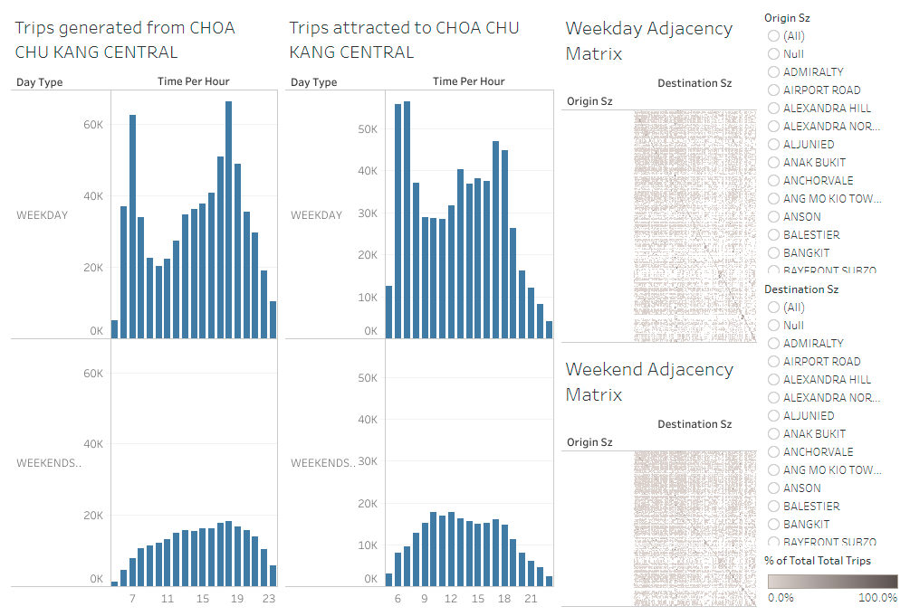
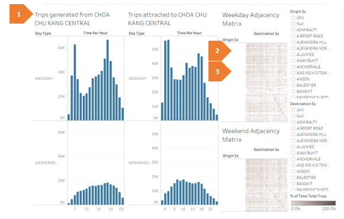
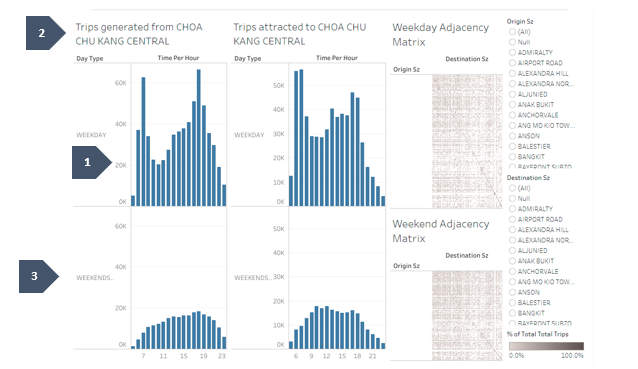
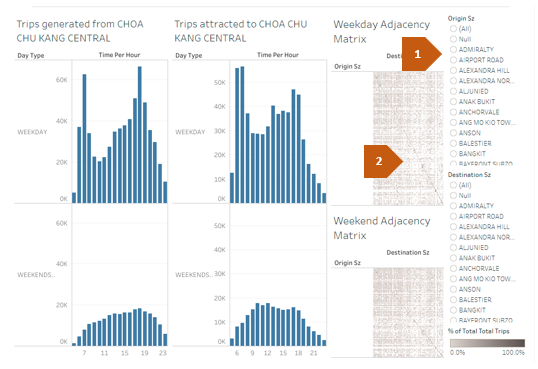
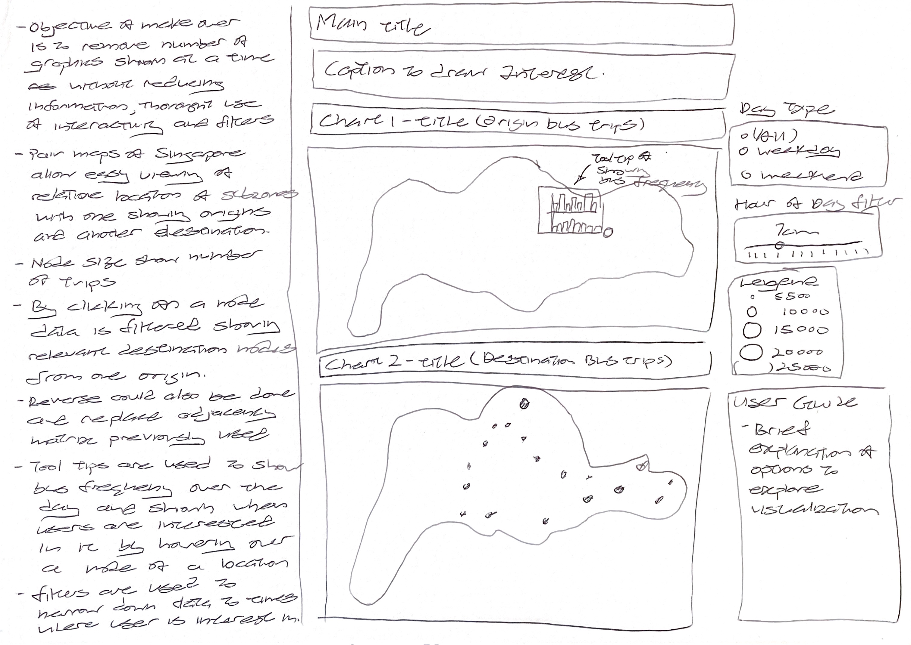
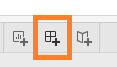

```{r setup, include=FALSE}
knitr::opts_chunk$set(
  fig.retina=3,
  echo = FALSE,
  eval = TRUE,
  warning = FALSE,
  message = FALSE
  )
```


```{r loading-packages}
packages = c('tidyverse', 'knitr', 'rmarkdown', 'kableExtra')

for(p in packages){library
  if(!require(p, character.only = T)){
    install.packages(p)
  }
  library(p, character.only = T)
}
```

# 1.0	The original visualization

The original interactive visualization shown above could be found [here](https://public.tableau.com/app/profile/tskam/viz/prototype1_16468762782120/Dashboard1) was created using data meticulously prepared and downloaded from LTA Datamall, URA region, planning area and planning subzone meant to visualize the intra- and inter- zonal public ride bus flows in Singapore for the period of Jan 2022.

# 2.	Critiques on Clarity, Aesthetics and Interactivity

The original graphic makes use of bar charts, adjacency matrix and filters for interactivity to show public bus flows at different times of the day. These are some of the issues in terms of clarity, aesthetics and interactivity identified. The critiques and suggestions are listed below:

In terms of **clarity**:



```{r}
Critique = c("**Chart title**: A chart title is not provided for the graphic and left to reader to interpret what the grahpic is about.",
             
             "**Compress Adjacency Matrix**: Due to size of the graphic, the adajcency matrix used to indicate links between origin and destination subzones is compressed and unreadable unless mouse hovers over the plot to show information in the tooltip.",
             
             "**User Guide**: A user guide is not provided for readers to understand how the current interactivity features work.")

Suggestion = c("Appropiate chart title such as 'Visualing Public Bus Flows for January 2022' could be used to give the reader an idea what the chart is about. ",
               
               "The large amounts of information and numberous individual level leads to a very dense adjacency matrix and limited space given to it creates a compressed graphic. Alternative visualization using interactivity could be used instead to represent the link between origin and destination. Filters could be used to reduce amount of data shown at one time.",
               
               "A brief description and guide could be provided such that readers would be able to fully appreciate what the visualization is about.")

clarity <- data.frame(Item = c(1,2,3), 
                        Critique,
                        Suggestion)

kable(clarity,align = "cll") %>%
kable_styling(full_width = F) %>%
column_spec(1, bold = T) %>%
column_spec(2, width = "30em") %>% 
column_spec(3, width = "30em")  

```
In terms of **aesthetics**:



```{r}

Critique <-  c("**Not using color**: While it is preferred that non-data ink be reduced in a visualization, the used of single color for all the bar graphs required readers to read the title to interpret difference between each chart.",
               "**Use of Multiple graphs**: Separate graphs are used to show each facet of the source, destination, weekday and weekend bus trip frequency. The reader would need keep track of numerous graphs to compare between them at a time.",
             "**Graph Size**: The use of multiple graphs does not readily allow all the graphs to be shown in one page, causing the reader to scroll between graphs in order to make a comparison.")

Suggestion = c("Appropriate colors could be used to indicate the different data that is shown in the graphic. For instance, blue could be used for origin graphics and a different color such as red for destination data would allow readers to intuitively separate the infromation.",
               
               "With interactivity and filters some of the graphics could be combined together and only shown when required as the reader explores the data. With focus on the links between source and destination, hourly frequency could be shown in a tooltip as the reader hovers over the data. The reader can then filter accordingly based on information shown in the tooltip.",
               
               "By combining the graphics together and using tooltips to show parts of the information, the remaining graphs could be shown in one page and allow for easier comparison of the information shown.")

aesthetics <- data.frame(Item = c(1,2,3),
                         Critique,
                         Suggestion
                         )

kable(aesthetics,align = "cll") %>%
kable_styling(full_width = F) %>%
column_spec(1, bold = T) %>%
column_spec(2, width = "30em") %>% 
column_spec(3, width = "30em")  


```
In terms of **interactivity**:



```{r}

Critique <-  c("**Separate Filters**: Separate filters are used for source sub zone and destination sub zone. Presented separately would allow the user to compare relative frequency of bustrip at two separate sub zones. However contextually the graphic is meant to show flows of buses between sub zones and filters for origin should result in corresponding filter in the destination data.",
               
               "**Use of Tooltips**: Due to compressed axis labels of the adjacency plot, tooltips were used to help show information in the adjacency plot, however it would be better used to reduce amount of graphics shown.",
               
               "**Not making use of Filters**: Currently filters are used for selecting the source and destination sub-zones presented. Filters could instead be used to reduce the amount of information shown and only when the user wishes to see it.")

Suggestion = c("Filters between the source and destination graphic could be linked, such that filtering to one source would show amount of trips to different locations. The reverse could also be done to show number of bus trips from different sources to a destination.",
               
               "Instead tooltips could be used to show other information that is not presented on the graphic or add additional details. An example would be to show the frequency bar graphs at source and at destination in the tooltip, reducing the graphs shown and could allow more space for other visualizations.",
               
               "Instead, filters could be used to either reduce the amount of information shown. For instance, it could be used to show one source sub zone with the corresponding destination subzones, possibly making the adjacency plot more readable.")

aesthetics <- data.frame(Item = c(1,2,3),
                         Critique,
                         Suggestion
                         )

kable(aesthetics,align = "cll") %>%
kable_styling(full_width = F) %>%
column_spec(1, bold = T) %>%
column_spec(2, width = "30em") %>% 
column_spec(3, width = "30em")  


```
# 3.	Proposed Design

## 3.1 Considersations

The assumed original intention of the visualization is to show intra- and inter zonal public bus flow. With that in mind the graph should show correspondingly connection between source and destination. 

The use of interactivity would allow several of the graphics to be combined together and be shown only when required. With focus on the bus flows, filters could be used to narrow the data to specific hours of the day and show specific source of trips and their respective destination where buses are going to. Correspondingly by linking filters between data sources, filtering the graphic to one destination should show where trips are coming from.

With tooltips the frequency of trips at different hours of the day could be shown when the user is hovering over a specific point and allow the reader to follow up by filtering the graphic to an hour of the day or source sub zone that he or she is interested in. 

## 3.2 Proposed Sketch



The data represents sub-zone locations around the country, presents the option of visualizing the data in the form of a map, allowing readers to see the relative positions of different localities to each other. The proposed makeover consist of a pair Singapore maps, with one showing location of sources and another the destinations. Two maps are used to allow for comparison between the origins and destinations. Separate maps are used instead of one map with both origin and destination together as the same sub zone could be both a source and destination leading to overlapping of data and cluttering of data points on the map. 

Maps are used as the main graphic due to size required to show all the points. If a map is displayed in a tool tip, small data points might not be visible.

Different colors would be used for origin and destination graphics.

Frequency of bus trips at a single hour of the day are represented by the size of points on the map. Larger dots would indicate more bus trips to or from a location and the relative size would allow readers to see the difference in frequency. 

The points on the map would also be configured as filters and linked between origin and destination such that when users click on a specific origin or destination the related other locations would be contextually filtered. Taking the function of an adjacency matrix. Size of the points would indicate relative number of trips from different sub zones. 

Filters are used to narrow down the data to a specific hour and either weekday or weekend bus trip data. This allows reader to focus on specific time periods of interest and with animation between transitions from one state to another, the reader could also see the difference between each state.

The overall frequency throughout the day on both weekend and weekdays would be shown in a tooltip as the user hovers over a specific locations. Giving readers an overview of the location, where the user could then adjust the filters based on information seem from the tooltip.

Relevant titles and brief users guide would be added to allow readers to understand what the graphic is about and what options are avialable to the reader.

## 3.2	Advantage of proposed design

The advantages of proposed design:

In terms of **clarity**

- Appropriate titles and user guide would allow the readers to be aware of the options available and how to interact with the visualization to draw their own insights and observations without being left to wonder what it is about.
- The use of a pair of maps and linked filters between origin and destination would function as a adjacency matrix to convey the same information. Through selecting a source or destination, readers would be able to see the destinations bus trips from a origin are going to. 
- The use of linked filters and interactivity would reduce the need for adjacency matrix, removing graphs from the visualization providing more space for other graphs that to be shown fully.

In terms of **aesthetics**

- The use of separate colors for graphs of origin and destination would allow readers to easily differentiate between the two plots rather than having to keep track of the titles and what each graph is about.
- Less graphs would also allow the map size to be increased for better readability.

In terms of **interactivity**

- Use of dots on screen as filters and the linking of filters between origin and destination would remove the two filters originally used.


# 4.	Data Visualization Process 

Data for this makeover has been provided in the form of a csv file 'origin_destination_bus__SZ_202201.csv' containing information on collated bus trip numbers from separate trip to destination sub zone and 'MP14_SUBZONE_WEB_PL' collection of shapefiles. Thus no editing or wrangling was done prior to use and following steps focuses on documenting the process of generating the visualization. 


The final visualization consist of a pair of maps, with tooltips to show bus trip frequency. Data is first loaded into tableau. Subsequently separately thematic map and bar graph of source and destination are created first before combining all graphics into a dashboard. 

## 4.1 Loading Data into Tableau

The first part would be to load required data for generating the visualization into tableau.

```{r}

Steps <-  c("Drag and drop origin_destination_bus__SZ_202201.csv into Tableau startup interface to load bus trip data.",
               "Click on 'Add' and select spatial file. In the windows explorer pop up select the 'MP14_SUBZONE_WEB_PL.shp' file from the directory where the file is stored to add shapefile data into tableau.",
             "By default origin_destination_bus__SZ_202201.csv should appear in the data pane. Click on  MP14_SUBZONE_WEB_PL in the connections pane, then drag and drop the .shp under the files pane to the data pane.",
             "Configure the relation between origin_destination_bus__SZ_202201.csv and MP14_SUBZONE_WEB_PL by selecting 'Origin Sz' column from origin_destination_bus__SZ_202201 and 'Subzone N' column from MP14_SUBZONE_WEB_PL.",
            "Click on 'Add more fields' in the relationship pane to configure a second relation to the shape file. This time chose 'Destination Sz' to relate to 'Subzone N'.",
            "To avoid confusion later, right click the origin_destination_bus__SZ_202201 block in the data pane and select rename to rename it as 'origin_sheet'.",
            "Next select origin_destination_bus__SZ_202201.csv in the connections pane then drag and drop origin_destination_bus__SZ_202201.csv into the data pane to have another copy of the data inside the data pane.",
            "Configure the relation between MP14_SUBZONE_WEB_PL.shp and the newly added origin_destination_bus__SZ_202201.csv sheet by selecting 'Subzone N' column for MP14_SUBZONE_WEB_PL.shp and 'Destination_SZ for origin_destination_bus__SZ_202201.csv sheet.",
            "right click the newly added origin_destination_bus__SZ_202201 block in the data pane and select rename to rename it as 'destination_sheet'.",
            "At this point required data for creating the visualizations is loaded into tableau as shown in the image."
            )

Images = c("",
           " ",
           ".",
           "",
           "",
           "",
           "",
           "",
           "",
           ""
           
           )

aesthetics <- data.frame(Item = c(1,2,3,4,5,6,7,8,9,10),
                         Steps,
                         Images
                         )

kable(aesthetics,align = "clc") %>%
kable_styling(full_width = F) %>%
column_spec(1, bold = T) %>%
column_spec(2, width = "20em") %>% 
column_spec(3, width = "40em")  


```


## 4.2 Source Thematic Map

The next part would be to create a thematic map representing number of trips from different source locations:

```{r}

Steps <-  c("Click on Sheet1 to start creating the visualization.",
               "Drag and drop 'Geometry' pill under MP14_SUBZONE_WEB_PL table to the main pane to add a map of Singapore to the graph.",
             "Right click Time Per Hour under origin_sheet and select 'convert to dimension'.",
             "Drag and drop the Time Per Hour to the filters pane, select 'All' then click okay.",
            "Right click on the Time Per Hour pill in filters pane and select show filter to add a filter to the graphic.",
            "Click on the small triangle in the Time per hour filters pane and select 'Single Value Slider' to change its appearance to a slider.",
            "Drag and drop the Day Type under origin sheet table to the filters pane, select 'All' then click okay.",
            "Right click on the Day Type pill in filters pane and select show filter to add a filter to the graphic.",
            "Click on the small triangle in the Day Type filter pane and select 'Single Value list' to change its appearance to a single value input.",
            "Drag and drop the 'Origin Sz' pill and Total Trips pill to details shelf and size shelf respectively.",
            "In the marks tap change the option from 'Automatic' to 'Circles'.",
            "Click on the 'Color' shelf and set opacity to 80% and change the border color to light gray.",
            "Right click the title and select edit title. Change the title to 'Bus Trip Origin'. Change to bold font and color to blue.",
            "Click on the thumbnail option that will show up when hovering the mouse on the top left corner of the map to fix the position of the map.",
            "Right the sheet name at the buttom of the sheet to rename the sheet as 'Origin'.",
            "At this point the result is a thematic map showing relative number of trips from each source subzone that could be filtered by hours of the day and weekday or weekday."
            )

Images = c("",
           " ",
           ".",
           "",
           "",
           "",
           "",
           "",
           "",
           "",
           "",
           "",
           "",
           "",
           "",
           ""
           )

aesthetics <- data.frame(Item = c(1,2,3,4,5,6,7,8,9,10,11,12,13,14,15,16),
                         Steps,
                         Images
                         )

kable(aesthetics,align = "clc") %>%
kable_styling(full_width = F) %>%
column_spec(1, bold = T) %>%
column_spec(2, width = "20em") %>% 
column_spec(3, width = "40em")  


```

## 4.3 Destination Thematic Map

The next part would be to create a thematic map representing number of trips to different destination locations. Most of the steps are similar to previous the section, however instead of using origin sz, destination sz will be used to summarize the trip numbers:

```{r}

Steps <-  c("Start by adding a new sheet by clicking 'new worksheet'.",
               "Drag and drop 'Geometry' pill under MP14_SUBZONE_WEB_PL table to the main pane to add a map of Singapore to the graph.",
             "Drag and drop the Time Per Hour under origin_sheet to the filters pane, select 'All' then click okay.",
            "Right click on the Time Per Hour pill in filters pane and select show filter to add a filter to the graphic.",
            "Click on the small triangle in the Time per hour filters pane and select 'Single Value Slider' to change its appearance to a slider.",
            "Drag and drop the Day Type pill under origin_sheet table to the filters pane, in the follow on pop up select 'All' then click okay.",
            "Right click on the Day Type pill in filters pane and select show filter to add a filter to the graphic.",
            "Click on the small triangle in the Day Type filter pane and select 'Single Value list' to change its appearance to a single value input.",
            "Drag and drop the 'Destination Sz' pill from under origin_sheet and Total Trips pill from uder origin_sheet to details shelf and size shelf respectively.",
            "In the marks tap change the option from 'Automatic' to 'Circles'.",
            "Click on colors in the marks pane and select red color to change color of the marks to red, opaciity to 80% and border to light gray.",
            "Right click the title and select edit title. Change the title to 'Bus Trip Destination'. Change to bold font and color to blue.",
            "Click on the thumbnail option that will show up when hovering the mouse on the top left corner of the map to fix the position of the map.",
            "Right click the sheet name at the buttom of the sheet to rename the sheet as 'Destination'.",
            "At this point the result is a thematic map show relative number of trips to each sub-zone that could be filtered by hour of the day and weekday or weekend trips."
            )

Images = c("",
           " ",
           "",
           "",
           "",
           "",
           "",
           "",
           "",
           "",
           "",
           "",
           "",
           "",
           ""
           )

aesthetics <- data.frame(Item = c(1,2,3,4,5,6,7,8,9,10,11,12,13,14,15),
                         Steps,
                         Images
                         )

kable(aesthetics,align = "clc") %>%
kable_styling(full_width = F) %>%
column_spec(1, bold = T) %>%
column_spec(2, width = "20em") %>% 
column_spec(3, width = "40em")  


```

## 4.3 Source Frequency Bar Graph

Next bar graphs showing the frequency of bus trips from a sub zone will be generated using the source_sheet data:

```{r}

Steps <-  c("Start by adding a new sheet by clicking 'new worksheet' icon at the bottom of the window.",
            "Drag and drop 'Origin Sz' pill from under origin_sheet.csv table to the filters pane. In the pop up menu select All then click ok.",
            "Right click on the Origin Sz pill in filters pane and select show filter to add a filter to the graphic.",
            "Click on the small triangle in the Origin Sz filters pane and select 'Single Value down' to change its appearance to a drop down list. Tentatively select one sub zone to filter data to one subzone.",
            "Drag and drop from under origins sheet table 'Time per hour' to columns shelf, Day Type to rows shelf and Total Trips to rows shelf.",
            "Right click the total trips axis labels and uncheck the show header option to hide the header labels. Then adjust the y-axis by hovering the move over the axis until the mouse icon change to the width adjustment icon then click and drag the axis to the right to show the full row label.",
            "Right click the top X-axis column label 'Time Per Hour' at the top of the worksheet and select hide field field labels for columns to hide them.",
            "Right click the top X-axis row label 'Day Type' at the top of the worksheet and select hide field labels for rows to hide them.",
            "Right click the chart title and select edit title to change the title to 'Frequeny of Trips Per Hour'. Configure the title to bold and blue in color.",
            "Change the size of the graph to entire view from the view option in the menu bar.",
            "Right click the worksheet name and select rename to change the worksheet name to OriginFreq.",
            "At this step a bar group for frequency of trips per hour from a origin location is generated."
            )

Images = c("",
           "",
           "",
           "",
           "",
           "",
           "",
           "",
           "",
           "",
           "",
           ""
           )

aesthetics <- data.frame(Item = c(1,2,3,4,5,6,7,8,9,10,11,12),
                         Steps,
                         Images
                         )

kable(aesthetics,align = "clc") %>%
kable_styling(full_width = F) %>%
column_spec(1, bold = T) %>%
column_spec(2, width = "20em") %>% 
column_spec(3, width = "40em")  


```

## 4.4 Destination Frequency Bar Graph

Next bar graphs showing the frequency of bus trips to a sub zone will be generated. Most steps are similar to the steps above with minor differences with which column data is selected for the chart:

```{r}

Steps <-  c("Start by adding a new sheet by clicking 'new worksheet' icon at the bottom of the window.",
            "Drag and drop 'destination Sz' pill from under Desitnation_sheet table to the filters pane. In the pop up menu select All then click ok.",
            "Right click on the Destinationn Sz pill in filters pane and select show filter to add a filter to the graphic.",
            "Click on the small triangle in the Destination Sz filters pane and select 'Single Value dropdown' to change its appearance to a drop down list. Tentatively select one sub zone to filter data to one subzone.",
            "Drag and drop from under Destination sheet table 'Time per hour' to columns shelf, Day Type to rows shelf and Total Trips to rows shelf.",
            "Right click the total trips axis labels and uncheck the show header option to hide the header labels. The adjust the y-axis by hovering the mouse over the axis until the mouse icon change to width adjustment icon then click and drag the axis to the right to show the full row label.",
            "Right click the top X-axis row label 'Day Type' at the top left corner of the worksheet and select hide row field labels to hide them.",
            "Right click the top X-axis column label 'Time Per Hour' at the top centre of the worksheet and select hide column field labels to hide them.",
            "Right click the chart title and select edit title to change the title to 'Frequeny of Arrivals Per Hour'. Configure the title to bold and blue in color.",
            "Click on colors in the marks shelf and select red to change the graph to red color.",
            "Change the size of the graph to entire view from the view option in the menu bar.",
            "Right click the worksheet name and select rename to change the worksheet name to DestinationFreq.",
            "At this step a bar graph for frequency of trips per hour to a destination location is generated."
            )

Images = c("",
           "",
           "",
           "",
           "",
           "",
           "",
           "",
           "",
           "",
           "",
           "",
           ""
           )

aesthetics <- data.frame(Item = c(1,2,3,4,5,6,7,8,9,10,11,12,13),
                         Steps,
                         Images
                         )

kable(aesthetics,align = "clc") %>%
kable_styling(full_width = F) %>%
column_spec(1, bold = T) %>%
column_spec(2, width = "20em") %>% 
column_spec(3, width = "40em")  


```

## 4.5 Assemble Dashboard and configurating interactivity 

In this part, the various visualizations are combine together in a dashbaord and interactivity is configured:

```{r}

Steps <-  c("Start by adding a new dashboard by clicking the 'New Dashboard' icon.",
            
            "Drag and drop the 'Origin' and 'Destination' worksheet into the dashboard pane. Positioning the 'Destination' worksheet under the the 'Origin' worksheet.",
            
            "Configure marks on the origin graph to be used as a filter by first clicking on the origin graph and select 'Use as filter' in the top right border. ",
            
            "To configure the action after filtering, click 'Actions' under the dashboard menu.",
            
            "In the follow on pop up actions menu, the first row would be the 'filter' action enabled on the graph. Select it and click edit.",
            
            "Configure the action by checking 'Origin' in source sheet, 'Destination' in target sheet, setting source field to 'Origin SZ' of origin worksheet and target field to 'Origin SZ' of destination sheet.",
            
            "Configure marks on the destination graph to be used as a filter by first clicking on the destination graph and select 'Use as filter' in the top right border. ",
            
            "Return to the actions menu by clicking 'Actions' under the dashboard menu.",
            
            "In the follow on pop up actions menu, a second filter action would appear, select it and click edit.",
            
            "Configuare the action by checking 'Destination' in source sheet, 'Origin' in target sheet, setting source field to 'Destination_sz' of destination sheet and target field to 'Destination Sz of origin' sheet.",
            
            "Click on Origin tab to return to the origin worksheet.",
            
            "Click on tooltip in the marks pane to bring up the tooltip options menu. Add a title 'Frequency of Bus Trips over the day' in bold, blue font, size 12. Click insert and select OriginFreq to add the origin bar graph to the tooltip. Edit the max width of the plot to 450 to show the full plot. Change the header 'Origin SZ' to 'Origin Subzone' and convert it to blue, bold font. Change the 'Total Trips' header to bold blue font as well. Then click okay.",
            
            "Click on Destination tab to return to the Destination worksheet.",
            
            "Click on tooltip in the marks pane to bring up the tooltip options menu. Add a title 'Frequency of Arrvials over the day' in bold, blue font, size 12. Click insert and select DestinationFreq to add the destination bar graph to the tooltip. Edit the max width of the plot to 450 to show the full plot. Change the header from 'DESTINATION_SZ (origin_destination_bus__SZ_202201.csv1)' to 'Destination Subzone' and convert it to blue, bold font. Change the SUM(TOTAL_TRIPS (origin_destination_bus__SZ_202201.csv1)) header to 'Total Arrvials' to bold blue font as well. Then click okay.",
            
            "Click on Dashboard tab to return to the Dashboard.",
            
            "Click on Day Type filter at the top right corner and click in the small triangle to bring up extra options. In the 'Apply to Worksheets' options, click 'Selected Worksheets'. In the follow on menu check 'Destination'.",
            
            "Click on Time Per Hour filter at the top right corner and click in the small triangle to bring up extra options. In the 'Apply to Worksheets' options, click 'Selected Worksheets'. In the follow on menu check 'Destination'.",
            
            "Remove duplicate filters 'Day_Type' and 'Time_Per_Hour' on the lower half of the dashboard by clicking on them and selecting 'Remove From Dashboard'.",
            
            "Right click the remaining 'Time Per Hour' filter at the top half of the dashboard and select 'edit title'. In the follow on pop up window change the filter title to 'Hour of the Day'.",
            
            "Click on the 'Total Trips' legend located on bottom half of the dashboard. Bring up the more options menu by clicking the small triangle, followed by clicking edit sizes. Change the 'Sizes vary' option to 'By Range. Check the 'start value for range' and change the value to 500. Check the 'End value for range' and change the value to 250000. Followed by clicking okay. This is to synchronize the mark sizes between both maps.",
            
            "Remove the 'Total Trips' legend on the lower half of the dashboard by clicking and it, followed by clicking 'Remove from dashboard'.",
            
            "Click on the remaining 'Total Trips' legend located on top half of the dashboard. Bring up the more options menu by clicking the small triangle, followed by clicking edit sizes. Change the 'Sizes vary' option to 'By Range. Check the 'start value for range' and change the value to 500. Check the 'End value for range' and change the value to 250000. Followed by clicking okay.",
            
            "Check 'show dashboard title' to add a title to dashboard.",
            
            "Right click on the title and select edit title. Change the title to 'Singapore Inter and Intra  Zonal Bus Flows Janurary - 2022' in blue, bold size 18 font. Add the following caption 'Highlighted in Land Transport master plan 2013, bus services aim to support the access to rail networks through intergrated transport hubs as well as direct links to other regions.   Click to explore this through public bus flow between origin and destination of bus trips.' in bold, black, size 12 font underneath the title.",
            
            "Add a text box by draging and droping 'text' box to the blank space on the lower right corner of the dashbaord.",
            
            "In the follow on pop up window for the text box. First add a header 'User Guide' in bold, blue font size 12 and select centre justify. Add the following suggestions 'Explore Inter and Intra - Zonal Bus flows for Janurary 2022. Click on any dot to see where bus trips are coming from or where they are going to. Hover over a dot to see frequency of trips over the different hours of the data. Filter to an hour of the day or select weekday or weekend to explore different trip frequencies.' in black, font size 11. Left Justify. Bullet points were added by copy and pasting the character from outside tableau.",
            
            "Drag and drop a 'Blank' object from the objects pane to space between the Day Type filter and the title to adjust the verticle position of the filters.",
            "Lastly before publishing the visualization right click the worksheet tab 'Origin' and select Hide. Do the same for worksheets, Destination, OriginFreq and DestinationFreq. "

            )

Images = c("",
           "",
           "",
           "",
           "",
           "",
           "",
           "",
           "",
           "",
           "",
           "",
           "",
           "",
           "",
           "",
           "",
           "",
           "",
           "",
           "",
           "",
           "",
           "",
           "",
           "",
           "",
           ""
           
           
           
           )

aesthetics <- data.frame(Item = c(1,2,3,4,5,6,7,8,9,10,11,12,13,14,15,16,17,18,19,20,21,22,23,24,25,26,27,28),
                         Steps,
                         Images
                         )

kable(aesthetics,align = "clc") %>%
kable_styling(full_width = F) %>%
column_spec(1, bold = T) %>%
column_spec(2, width = "20em") %>% 
column_spec(3, width = "40em")  


```
The visualization is completed.

# 5. Final Visualization

A screenshot of the final visualization is shown below:


Full visualization could be found on tableau public [here](https://public.tableau.com/app/profile/caine.ng/viz/DatavizMakeover2_16480065813330/Dashboard1#8)

# 7.	Main Observations

Listed below are some of the observations drawn from the graphic after makeover with reference to Land Transport Master Plan 2013 which could be found [here](https://www.lta.gov.sg/content/dam/ltagov/who_we_are/statistics_and_publications/master-plans/pdf/LTMP2013Report.pdf) :


```{r}
aesthetics <- data.frame(Item = c(1),
                         Obervation = c("Obserable regional hubs."),
                         
                         Takeaway = c("Visible in visualization after makeover is the location of integrated transport hubs represented by nodes with relative higher number of bus trips both to and from these locations. Referencing the land transport master plan 2013 (LTMP2013) more interchanges act as locations where communters could shop and have a meal between transfers from bus to mrt. Most visible of these nodes are Tampines, Bedok north, Jurong west and Woodlands east."))

library(knitr)
kable(aesthetics,align = "cll")%>%
kable_styling(full_width = F) %>%
column_spec(1, bold = T) %>%
column_spec(2, width = "20em") %>% 
column_spec(3, width = "40em") 

```


```{r}
aesthetics <- data.frame(Item = c(2,3),
                         Obervation = c("Higher number of bus trips in sub zone vincinty.",
                                        "Travel between subzones is still obersved."),
                         
                         Takeaway = c("Clicking on most nodes, it could be observed that most bus trips end in nearby regional subzones. Highlighting the use of public bus transport as means of travel to connect between regional sub zones and to regional interchanges before converting to MRT rail transport. For instance, clicking on tampines node in the visualization, most highlighted destination subzones are in nearby region, such as Semei and Tampines west. ",
                                      "While bus transportation is mainly used for regional sub zone travel, it could be observed by clicking on a node destinations could also reach the other side of the island. Communters from Jurong west central could be seen having destinations as far as Bedok. This is similarly mentioned in LTMP 2013, to give commuters more options to travel, parallel bus services that ply along expressways between fringe towns to city areas to augment rail transportation."))


library(knitr)
kable(aesthetics,align = "cll")%>%
kable_styling(full_width = F) %>%
column_spec(1, bold = T) %>%
column_spec(2, width = "20em") %>% 
column_spec(3, width = "40em") 

```


